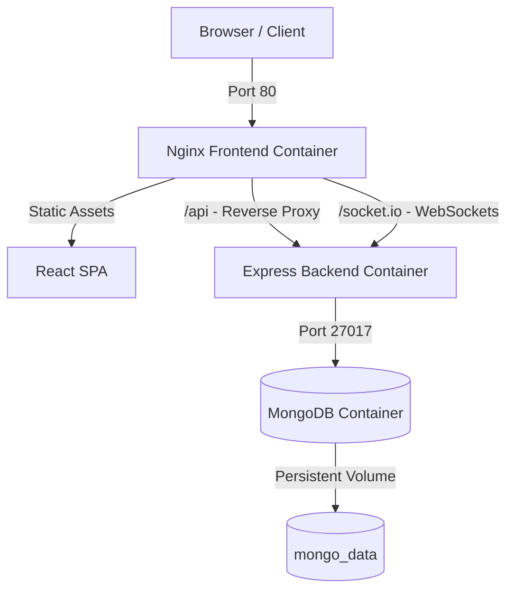

# 🚀 Task Management System - Deployment Guide

Welcome to the deployment guide for your fully containerized, premium Task Management System! This guide outlines how to build, run, and scale your application locally using Docker, as well as deploy it to major cloud platforms.

---

## 🏗️ Architecture Overview

The application is structured as a decoupled, multi-container system orchestrating:
1. **Frontend**: A React single-page application built with Vite, served by **Nginx** in a lightweight production container. Nginx acts as a reverse proxy, directing traffic to `/api` and `/socket.io` directly to the backend.
2. **Backend**: A Node.js REST API with Express and Socket.io, containerized using a secure, optimized **multi-stage build**.
3. **Database**: A **MongoDB (v6)** database persistent storage container using Docker volumes.



---

## 💻 1. Local Deployment (Docker Compose)

Follow these steps to run the complete stack locally using Docker.

### Step 1: Open Docker Desktop
Ensure **Docker Desktop** is open and running on your system.
> [!NOTE]
> On Windows, Docker Desktop must be running so the Docker CLI can connect to the background Linux engine socket (`npipe:////./pipe/dockerDesktopLinuxEngine`).

### Step 2: Configure Environment Variables
Create a `.env` file in the **root** folder of your project to customize sensitive production-grade settings, or the system will use safe default values automatically:
```env
JWT_SECRET=your_super_secret_jwt_key
CLOUDINARY_CLOUD_NAME=your_cloudinary_name
CLOUDINARY_API_KEY=your_cloudinary_key
CLOUDINARY_API_SECRET=your_cloudinary_secret
EMAIL_USER=your_email@gmail.com
EMAIL_APP_PASSWORD=your_gmail_app_password
```

### Step 3: Start the Stack
Open your terminal (PowerShell, Command Prompt, or bash) in the project root folder and execute:
```bash
docker compose up --build
```
This command will:
1. Fetch official base images (`node:18-alpine`, `nginx:stable-alpine`, `mongo:6`).
2. Run the multi-stage build for the backend (only copying production dependencies).
3. Run the multi-stage build for the frontend (compiling the Vite build and moving it to Nginx).
4. Spin up all three containers in a custom internal network.

### Step 4: Verify and Access
Once startup is complete, open your browser and navigate to:
* **Frontend Application**: [http://localhost](http://localhost) (Served on port 80)
* **Backend API**: [http://localhost:5000](http://localhost:5000)
* **API Documentation**: [http://localhost:5000/api-docs](http://localhost:5000/api-docs) (if enabled)

### Step 5: Shutting Down
To stop and clean up the containers while retaining database persistence, press `Ctrl + C` in your terminal or run:
```bash
docker compose down
```

---

## ☁️ 2. Cloud Deployment (Production)

Below are step-by-step guidelines for deploying this architecture on the cloud.

### Option A: Railway (Highly Recommended - Single Config)
[Railway](https://railway.app/) is the easiest platform for containerized applications, as it parses `docker-compose.yml` automatically.

1. **Sign Up / Log In** to [Railway.app](https://railway.app/).
2. Click **New Project** -> **Deploy from GitHub repo**.
3. Select your task-management repository.
4. Railway will automatically detect the `docker-compose.yml` file and provision:
   * A MongoDB service.
   * A Backend service.
   * A Frontend service.
5. **Configure Variables**:
   * For the **Backend** service, add the environment variables (`JWT_SECRET`, `CLOUDINARY_CLOUD_NAME`, etc.).
   * Ensure `CLIENT_URL` is set to the generated frontend domain (e.g., `https://your-frontend.up.railway.app`).
6. **Generate Domain**:
   * Go to the **Frontend** service settings and click **Generate Domain** to get a public URL.

---

### Option B: Render (Database + Backend) + Vercel (Frontend)
This decoupled approach provides massive performance and is 100% free.

#### 1. Deploy MongoDB (Render or MongoDB Atlas)
* Sign up for [MongoDB Atlas](https://www.mongodb.com/products/platform/atlas-database) (Free Tier).
* Create a cluster, obtain your connection string (`mongodb+srv://...`), and allow access from all IPs (`0.0.0.0/0`).

#### 2. Deploy Backend (Render)
* Sign up/in to [Render](https://render.com/).
* Click **New** -> **Web Service** and link your repo.
* Set the Root Directory to `backend`.
* Choose **Docker** as the Runtime (Render will automatically use the `backend/Dockerfile` with its optimized multi-stage build!).
* Add Environment Variables:
  * `MONGODB_URI`: *Your MongoDB Atlas connection string*
  * `NODE_ENV`: `production`
  * `JWT_SECRET`: *A secure random string*
  * `CLIENT_URL`: *Your Vercel URL (set this after deploying frontend)*
* Render will compile and host the API.

#### 3. Deploy Frontend (Vercel)
* Sign up/in to [Vercel](https://vercel.com/).
* Click **Add New** -> **Project** and import your repo.
* Configure Project settings:
  * **Framework Preset**: `Vite`
  * **Root Directory**: `frontend`
* Add Environment Variable:
  * `VITE_API_URL`: *Your Render backend URL (e.g., `https://task-backend.onrender.com`)*
* Click **Deploy**. Vercel will build your static React files and serve them over a globally distributed CDN.
* *Remember to go back to Render and update the backend's `CLIENT_URL` with your Vercel URL to allow CORS!*

---

### Option C: DigitalOcean App Platform
DigitalOcean supports monorepos with Docker configurations seamlessly.

1. Create a **New App** in the DigitalOcean Control Panel.
2. Select your GitHub repository.
3. Configure the components:
   * **Database**: Add a Managed MongoDB database cluster.
   * **Backend Service**:
     * Set Source Directory to `backend`.
     * Set build method to **Docker** (it auto-detects `Dockerfile`).
     * Set HTTP Port to `5000`.
     * Add env variables: `MONGODB_URI` bind to database connection string, `JWT_SECRET`, etc.
   * **Frontend Static Site**:
     * Set Source Directory to `frontend`.
     * Build Command: `npm run build`.
     * Output Directory: `dist`.
     * Add env variable `VITE_API_URL` pointing to the Backend component URL.

---

## 🛠️ Troubleshooting

### ❌ Docker Daemon Error (Windows)
**Error:** `failed to connect to the docker API at npipe:////./pipe/dockerDesktopLinuxEngine...`
* **Fix:** Open **Docker Desktop** from your start menu, wait for the green indicator (Docker running), and retry the command.

### ❌ Port Conflict
**Error:** `Bind for 0.0.0.0:80 failed: port is already allocated`
* **Fix:** Another application (like IIS, Skype, or Apache) is using port 80. You can change the port mapping in `docker-compose.yml`:
  ```yaml
  frontend:
    ports:
      - "8080:80"  # Change host port to 8080
  ```
  Then access the app at `http://localhost:8080`.

---

## 🐙 3. Git Workflow Best Practices

To finalize Phase 10 with high quality, commit your work to Git:

1. **Create a Deployment Feature Branch**:
   ```bash
   git checkout -b feature/phase10-docker-deployment
   ```
2. **Stage your changes**:
   ```bash
   git add docker-compose.yml backend/Dockerfile frontend/Dockerfile frontend/.dockerignore frontend/nginx.conf frontend/src/hooks/useSocket.js DEPLOYMENT.md
   ```
3. **Commit with a descriptive message**:
   ```bash
   git commit -m "feat(deployment): add multi-stage docker configurations, self-healing websockets, nginx reverse proxy, and deployment guide"
   ```
4. **Push & Open a Pull Request (PR)**:
   ```bash
   git push origin feature/phase10-docker-deployment
   ```

Your task management stack is now 100% production-ready! 🚀
